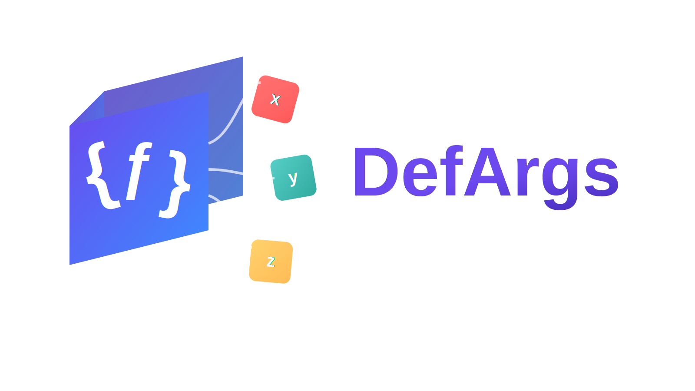

# DefArgs IntelliJ IDEA Plugin

[](https://github.com/thirty30ww/defargs-intellij-plugin/releases)
[](https://opensource.org/licenses/MIT)

为 [DefArgs](https://github.com/thirty30ww/defargs) 注解处理器提供 IntelliJ IDEA 支持的插件。

## 解决的问题

当你在项目中使用 DefArgs 注解处理器时，IDEA 无法识别编译时生成的重载方法，导致代码中出现红色错误提示：

```java
service.createUser("Alice");  // 报错：找不到方法
```

虽然项目能够正常编译和运行，但这些"假错误"会干扰开发。这个插件让 IDEA 能够理解 DefArgs 生成的代码，消除这些误报。

## 安装方法

### 手动安装
0
1. 从 [Releases](https://github.com/thirty30ww/defargs-intellij-plugin/releases) 页面下载最新的插件 zip 包
2. 打开 IDEA，进入 `Settings` → `Plugins` → 齿轮图标 → `Install Plugin from Disk...`
3. 选择下载的 zip 包并安装
4. 重启 IDEA

### 从源码构建

```bash
gradlew buildPlugin
```

生成的插件位于 `build/distributions/defargs-intellij-plugin-version.zip`

## 使用方法

安装插件后，IDEA 会自动识别项目中的 `@DefaultValue` 和 `@Omittable` 注解。无需任何配置，打开使用了 DefArgs 的项目即可看到效果：

> 原本显示错误的方法调用不再标红，代码补全也能正确提示生成的重载方法。

## 支持的功能

- **具体类方法**：识别 `@DefaultValue` 注解，生成带默认值的虚拟重载方法
- **接口和抽象类**：识别 `@Omittable` 注解，生成抽象重载方法声明
- **代码补全**：自动补全生成的重载方法
- **方法跳转**：支持跳转到原始方法定义
- **引用查找**：能够找到对虚拟重载方法的所有调用
- **冲突检测**：检测手动定义的方法是否与生成的重载方法冲突
- **注解使用检查与快速修复**：
  - **实时检测**：检测 `@DefaultValue` 和 `@Omittable` 的错误使用
  - **快速修复**：在抽象方法上使用 `@DefaultValue` 时，提供一键转换为 `@Omittable`（Alt+Enter）
  - **双向转换**：在具体方法上使用 `@Omittable` 时，提供一键转换为 `@DefaultValue`（Alt+Enter）
  - **智能 import**：快速修复会自动添加必要的 import 语句

## 兼容性

支持 IntelliJ IDEA 2024.1 及更高版本（包括 Community 和 Ultimate 版本）。

## 协议

MIT License

